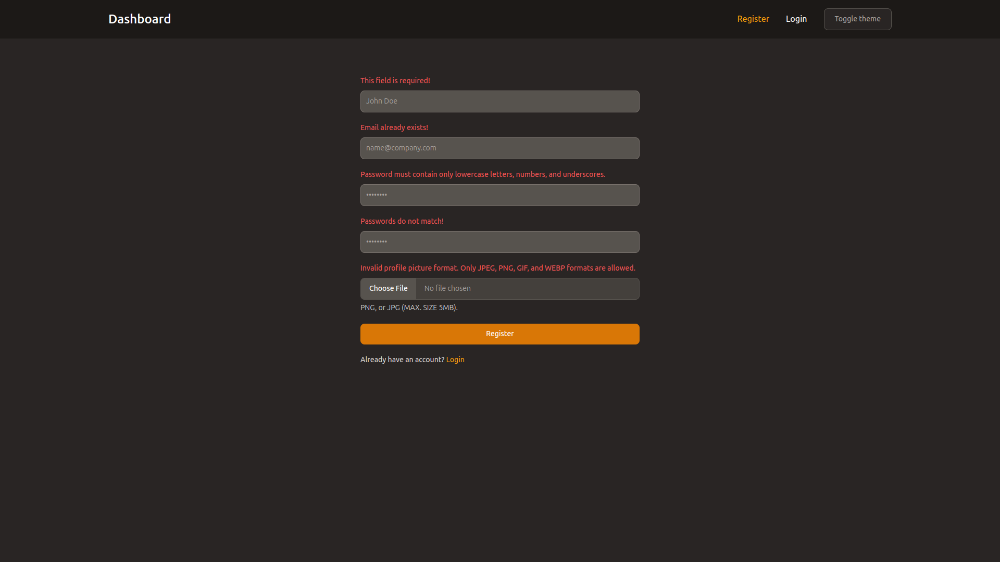

### User Authentication and Management System

**Project Overview**

This project is a simple demonstration of user authentication, management, and CRUD operations built using PHP, MySQL, Tailwind CSS, and Flowbite. The system offers basic user registration, login, and profile management functionalities.

**Key Features**

- User Registration with strict validations
- User Login with session management
- Protected home page accessible only to authenticated users
- User listing with search and pagination
- User deletion (including self-deletion)
- User profile editing (name, password, profile picture)
- Modern and responsive UI using Tailwind CSS and Flowbite

**Technology Stack**

- **Backend:** PHP, MySQL
- **Frontend:** HTML, CSS (Tailwind CSS), JavaScript, Flowbite
- **Database:** MySQL

**Project Structure**

- **public:** Contains the public-facing files (index.php, login.php, register.php, etc.)
- **includes:** Stores reusable PHP scripts (functions, database connection, etc.)
- **css:** Contains custom CSS styles
- **assets:** Stores images, JavaScript files, and other static assets

**Installation and Setup**

1. **Clone the repository:**
   ```bash
   git clone https://github.com/Ahmedd26/crud-dashboard-using-php.git
   ```
2. **Set up database:**
   - Create a MySQL database and user with appropriate permissions.
   - Import the provided SQL schema to create tables.
   - Update database credentials in the `config.php` file.
3. **Web server configuration:**
   - Configure your web server (Apache, Nginx) to serve the project files from the `public` directory.

**Usage**

- Access the application through a web browser.
- Perform user registration, login, and other available actions.

**Screenshots**





